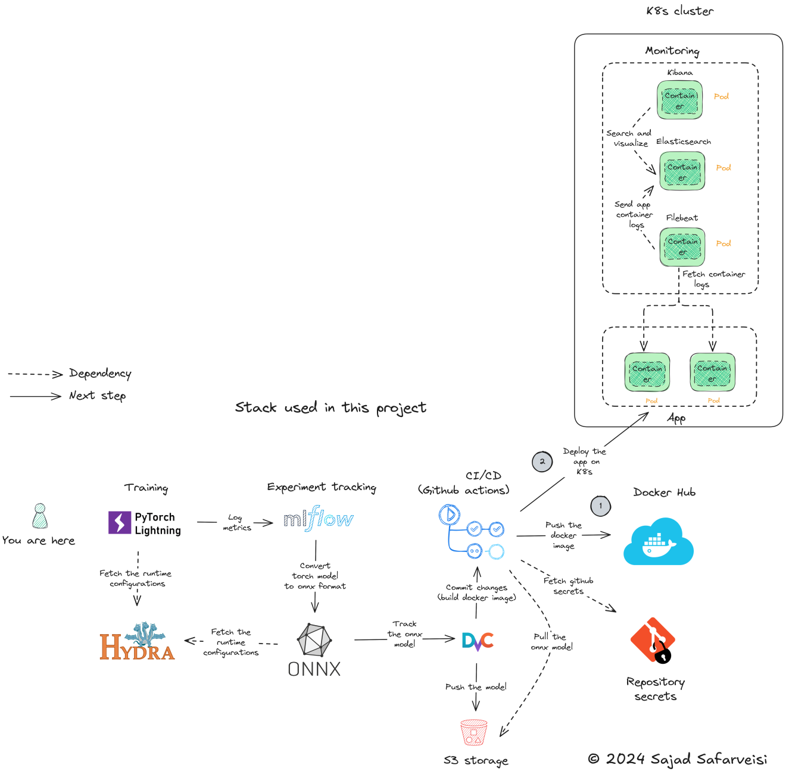

## Stack Diagram

## Module Overview

This table provides an overview of the purpose and responsibilities of each Python module in the repository.

| Module                   | Usage                                                                                         |
|--------------------------|-----------------------------------------------------------------------------------------------|
| `train.py`               | Used to fine-tune a BERT model (`google/bert_uncased_L-2_H-128_A-2` from Hugging Face) for a downstream classification task. |
| `model.py`               | Configures the fine-tuning process, including defining which metrics to track and early stopping criteria. |
| `data.py`                | Fetches and prepares the required data for training and ensures it is in the correct format.  |
| `app.py`                 |  Sets up a FastAPI application to provide a web API for predictions using the `ColaONNXPredictor`. |
|                          | It includes endpoints for a home page and a prediction service that accepts text input and returns the prediction result. |
| `convert_model_to_onnx.py` | Converts the torch model into ONNX format |
| `inference_onnx.py`     | Implements `ColaONNXPredictor`, which loads an ONNX model and |
|                         | provides text prediction, determining if the text is acceptable or unacceptable |
| `utils.py`               | Collection of helper functions (e.g., `get_dvc_file_from_s3` which is used to get the tracked ONNX-formatted model from the s3 storage) |

## Acknowledgments

This repository is based on the original work [MLOps-Basics](https://github.com/graviraja/MLOps-Basics) by graviraja. I extend my gratitude to the original author and contributors for their contributions to MLOps practices.

The work presented in this repository builds upon the existing framework with improvements to adapt to the latest developments in Python packages and address issues while enhancing the MLOps stack used. My goal is to modernize the implementation to better align with current industry standards and practices while maintaining the spirit of the original project.